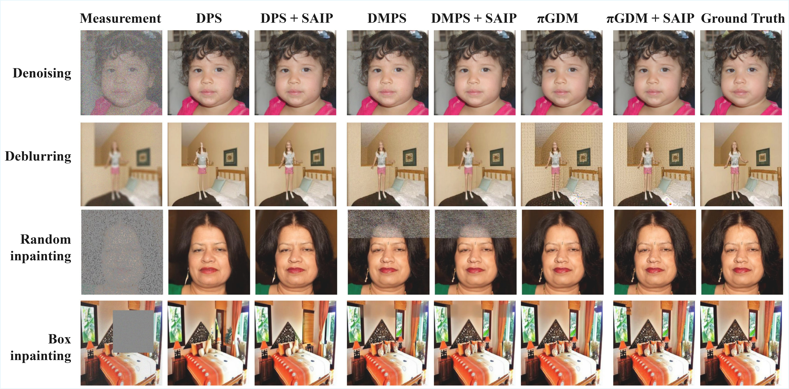

# 🌟 SAIP: A Plug-and-Play Scale-Adaptive Module in Diffusion-Based Inverse Problems

## 📜 Abstract

Solving inverse problems using diffusion models has gained significant attention in image restoration. A common approach involves formulating the task under a Bayesian framework, using **posterior sampling** that combines the *prior score* and the *likelihood score*.
However, since the likelihood score is often intractable, recent methods like **DPS**, **DMPS**, and **πGDM** resort to surrogate approximations.

Despite their effectiveness, these methods share a core limitation:

> ✅ **A manually fixed scale coefficient is required to balance prior and likelihood contributions.**

This static setting restricts adaptability across different timesteps and tasks.

---

### ✅ Our Solution: **SAIP**

We propose **SAIP**, a plug-and-play module that **adapts the scale coefficient at each timestep**. SAIP can be seamlessly integrated into **any sampling framework** without retraining or modifying the diffusion backbone.

🧪 **Highlights**:

* Adaptive scale refinement.
* Task-agnostic and timestep-aware.
* No retraining required.
* Effective on both standard and challenging inverse tasks.

---

### 🎨 Visual Demo

> Typical results of DPS, DMPS, and πGDM each augmented with SAIP on four inverse tasks.



---

## ⚙️ Prerequisites

* Python: `3.8.20`
* PyTorch: `1.11.0`
* CUDA: `11.3`

### 🔧 Setup Environment


```bash
conda create -n SAIP python=3.8
conda activate SAIP

pip install -r requirements.txt

pip install torch==1.11.0+cu113 torchvision==0.12.0+cu113 torchaudio==0.11.0 --extra-index-url https://download.pytorch.org/whl/cu113
```

#### If mpi4py fails via pip:

```bash
conda install mpi4py
```

#### Additional dependencies:

```bash
pip install scikit-image blobfile
```

> 💡 GPU is **highly recommended**, although CPU is also supported.

🔹 **Note:** If you would like to run **DiffStateGrad**, please follow the environment setup instructions provided in the official repository: [Anima-Lab/DiffStateGrad](https://github.com/Anima-Lab/DiffStateGrad), instead of using the above configuration.

---

## 📦 Pretrained Checkpoints

| Dataset          | Checkpoint Link                                                                                      | Save Path                  |
| ---------------- | ---------------------------------------------------------------------------------------------------- | -------------------------- |
| **FFHQ**         | [Google Drive](https://drive.google.com/drive/folders/1jElnRoFv7b31fG0v6pTSQkelbSX3xGZh?usp=sharing) | `./models/ffhq_10m.pt`     |
| **LSUN Bedroom** | [OpenAI Repo](https://github.com/openai/guided-diffusion)                                            | `./models/lsun_bedroom.pt` |

---

## 📁 Dataset Preparation

Set the `data.root` path in configs (default: `./data/samples`).
We provide:

* Sample images from **FFHQ validation set**
* Additional LSUN-dataset datasets used in our experiments(default: `./data/samples_bedroom`)

---

## 🚀 Sampling Procedure
Run DPS with:

```bash
python3 sample_condition.py \
  --model_config=configs/model_config.yaml \
  --diffusion_config=configs/diffusion_config.yaml \
  --task_config={TASK-CONFIG} \
  --save_dir ./saved_results
```

Run DMPS or PGDM with:

```bash
python3 main.py \
  --model_config=configs/model_config.yaml \
  --diffusion_config=configs/diffusion_config.yaml \
  --task_config={TASK-CONFIG} \
  --save_dir ./saved_results
```

---

## 📋 Available Model Configurations

```text
- configs/model_config.yaml 
- configs/model_config_lsunbedroom.yaml
```

---

## 🧪 Configurations for Linear Inverse Problems

### ✅ Standard Tasks on FFHQ 
Notice : configs of LSUN-bedroom also in the same dictionary.
#### DPS + SAIP

```text
- configs/ffhq_deblur_uniform_config.yaml
- configs/ffhq_denoise_config.yaml
- configs/ffhq_inpainting_config_box.yaml
- configs/ffhq_inpainting_config_random.yaml
```

#### DMPS + SAIP

```text
- configs/ffhq_deblur_uniform_config.yaml
- configs/ffhq_denoise_config.yaml
- configs/ffhq_inpainting_config_box.yaml
- configs/ffhq_inpainting_config_random.yaml
```

#### PGDM + SAIP

```text
- configspgdm/ffhq_deblur_uniform_config.yaml
- configspgdm/ffhq_denoise_config.yaml
- configspgdm/ffhq_inpainting_config_box.yaml
- configspgdm/ffhq_inpainting_config_random.yaml
```

---

### ⚠️ Challenging Tasks

#### 🔁 High Degradation

> Tasks with *strong corruption or missing data*.

**DPS + SAIP**

```text
- configs/challengeTask/Cffhq_denoise_config.yaml
- configs/challengeTask/Cffhq_inpainting_config_box.yaml
- configs/challengeTask/Cffhq_inpainting_config_random.yaml
```

**DMPS + SAIP**

```text
- configs/challengeTask/Cffhq_denoise_config.yaml
- configs/challengeTask/Cffhq_inpainting_config_box.yaml
- configs/challengeTask/Cffhq_inpainting_config_random.yaml
```

**PGDM + SAIP**

```text
- configs/challengeTask/Cpgdmffhq_denoise_config.yaml
- configs/challengeTask/Cpgdmffhq_inpainting_config_box.yaml
- configs/challengeTask/Cpgdmffhq_inpainting_config_random.yaml
```

---

#### 🔊 High-Level Noise

> Standard operators under *extremely noisy conditions*.

**DPS + SAIP**

```text
- configs/denoiseTask/Dffhq_deblur_uniform_config.yaml
- configs/denoiseTask/Dffhq_inpainting_config_box.yaml
- configs/denoiseTask/Dffhq_inpainting_config_random.yaml
```

**DMPS + SAIP**

```text
- configs/DenoiseTask/Dffhq_deblur_uniform_config.yaml
- configs/DenoiseTask/Dffhq_inpainting_config_box.yaml
- configs/DenoiseTask/Dffhq_inpainting_config_random.yaml
```

**PGDM + SAIP**

```text
- configs/DenoiseTask/Dpgdmffhq_deblur_uniform_config.yaml
- configs/DenoiseTask/Dpgdmffhq_inpainting_config_box.yaml
- configs/DenoiseTask/Dpgdmffhq_inpainting_config_random.yaml
```

---

## 📚 References

This repository is built upon the following works:

* [DPS: Diffusion Posterior Sampling (Chung et al., 2022)](https://arxiv.org/abs/2209.14687)
* [DMPS: Diffusion-based Posterior Sampling (Meng & Kabashima, 2022)](https://arxiv.org/abs/2211.12343)
* [PGDM: Pseudoinverse-guided diffusion models for inverse problems (Song et al., 2023)](https://openreview.net/forum?id=9_gsMA8MRKQ)
* [Diffusion State-Guided Projected Gradient for Inverse Problems (Zirvi et al., 2024)](https://arxiv.org/abs/2410.03463)

```bibtex
@article{chung2022diffusion,
  title={Diffusion Posterior Sampling for General Noisy Inverse Problems},
  author={Chung, Hyungjin and Kim, Jeongsol and Mccann, Michael T and Klasky, Marc L and Ye, Jong Chul},
  journal={arXiv preprint arXiv:2209.14687},
  year={2022}
}

@article{meng2022diffusion,
  title={Diffusion model based posterior sampling for noisy linear inverse problems},
  author={Meng, Xiangming and Kabashima, Yoshiyuki},
  journal={arXiv preprint arXiv:2211.12343},
  year={2022}
}

@inproceedings{song2023pseudoinverse,
  title={Pseudoinverse-guided diffusion models for inverse problems},
  author={Song, Jiaming and Vahdat, Arash and Mardani, Morteza and Kautz, Jan},
  booktitle={International Conference on Learning Representations},
  year={2023}
}

@article{zirvi2024diffusion,
  title={Diffusion state-guided projected gradient for inverse problems},
  author={Zirvi, Rayhan and Tolooshams, Bahareh and Anandkumar, Anima},
  journal={arXiv preprint arXiv:2410.03463},
  year={2024}
}

```

---

📬 *For questions or feedback, feel free to open an issue or contact the authors.*


